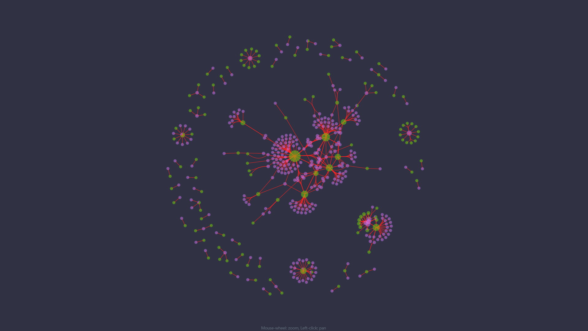
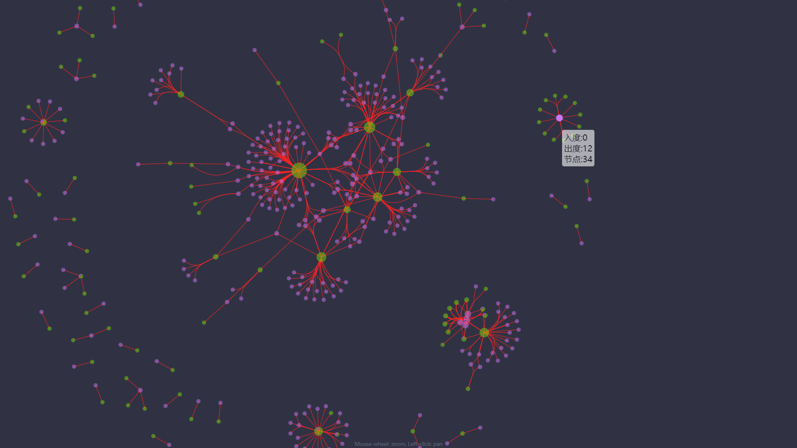

## 力导向图+边绑定
>虽然点-线图提供了直观的可视化，但是当数据存在大量节点和边时，视觉混乱（Visual Clutter）很快成为严重的问题。点-线图中的视觉混乱通常是边缘拥塞的直接结果，而在如交通网络一类数据中，节点位置通常具有明确定义的含义，并不总是可以修改节点位置以减少视觉混乱。因此，学术界诸多研究者设计了各种通过优化边的方式减轻上述视觉混乱，其中边绑定（Edge Bundling）方法被广泛研究和应用。

>技术栈：d3.js

>功能：对布局后的图形使用边绑定算法。
>节点大小表示度的大小，绿色表示入度，紫色表示出度，饼图的面积表示出入度的相对大小。
>并增加hover的交互，使用 tooltip 展示每个节点的信息。
>当zoom时候，保证节点、边的大小不变。

